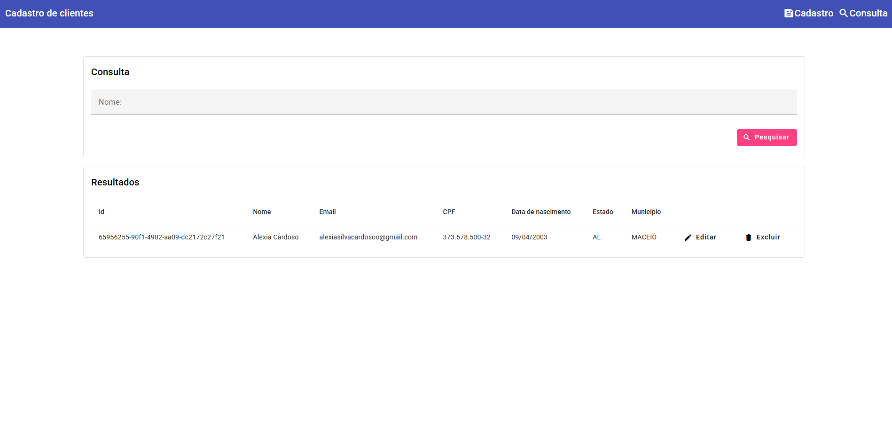

# CrudAngularMaterial



Baixe [aqui](./public/demo.mp4) um vídeo curto demonstrando a aplicação.

Desenvolvido para realizar estudos sobre CRUD em angular

Esse projeto foi desenvolvido utilizando [Angular CLI](https://github.com/angular/angular-cli) na versão 19.0.2.

This project was generated using [Angular CLI](https://github.com/angular/angular-cli) version 19.0.2.

## Ambiente de desenvolvimento

Para poder abrir a aplicação localmente é necessário utilizar o comando: 

```bash
ng serve
```

Uma vez que o servidor esteja rodando é possível acessar a interface web no link `http://localhost:4200/`. A aplicação irá atualizar automaticamente caso haja alguma alteração nos arquivos

## Funcionalidades

Armazenamento em local storage

1. Cadastrar
2. Consultar

## API

Consome dados da api [brasilapi](https://brasilapi.com.br/docs)